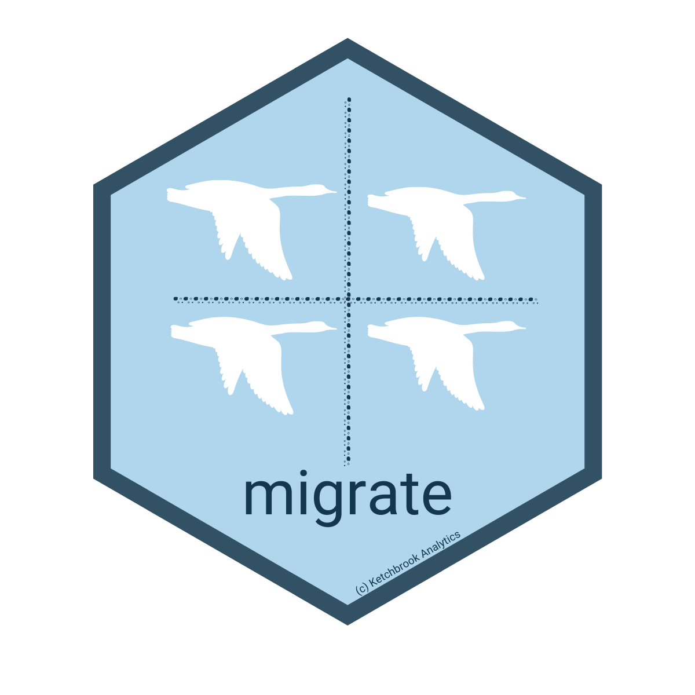

<!-- README.md is generated from README.Rmd. Please edit that file -->

```{r, include = FALSE}
knitr::opts_chunk$set(
  collapse = TRUE,
  comment = "#>",
  fig.path = "man/figures/README-",
  out.width = "100%"
)
```

# migrate 

<!-- badges: start -->
<!-- badges: end -->

The goal of migrate is to provide credit analysts with an easy set of tools for building *state migration matrices* (also known as *"state transition matrices"*). 

## Installation

You can install the released version of migrate from [CRAN](https://CRAN.R-project.org) with:

``` {r, eval = FALSE}
install.packages("migrate")
```

And the development version from [GitHub](https://github.com/) with:

``` {r, eval = FALSE}
# install.packages("devtools")
devtools::install_github("mthomas-ketchbrook/migrate")
```
## Example

First load the package & the mock dataset (as a data frame) using `library()`

```{r, eval = FALSE}
library(migrate)
data("mock_credit")
```

We can get a look at the data using `dplyr::glimpse()`

```{r glimpse, eval = FALSE}
glimpse(mock_credit)
```

Note that an important feature of the dataset is that there are exactly two (2) unique values in the `date` column variable

```{r dates, eval = FALSE}
unique(mock_credit$date)
```

To summarize the migration within the data, use the `migrate()` function

```{r migrate, eval = FALSE}
migrated_df <- migrate(
  data = mock_credit, 
  date = date, 
  rating = risk_rating, 
  metric = principal_balance
)

head(migrated_df)
```

To create the state migration matrix, use the `build_matrix()` function
```{r matrix, eval = FALSE} 
build_matrix(migrated_df)
```

Or, to do it all in one shot, use the `%>%`
```{r pipe, eval = FALSE} 
mock_credit %>% 
  migrate(
    data = mock_credit, 
    date = date, 
    rating = risk_rating, 
    metric = principal_balance
  ) %>% 
  build_matrix()
```
