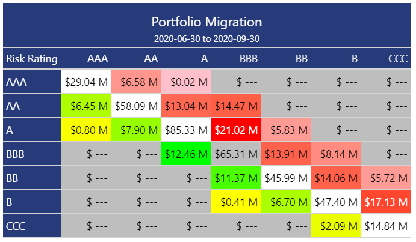

<!-- README.md is generated from README.Rmd. Please edit that file -->

```{r, include = FALSE}
options(width = 999)

knitr::opts_chunk$set(
  collapse = TRUE,
  comment = "#>",
  fig.path = "man/figures/README-",
  out.width = "100%"
)

devtools::load_all()
```

# migrate 

<!-- badges: start -->
[](https://www.tidyverse.org/lifecycle/#maturing)
[](https://CRAN.R-project.org/package=migrate)
[](https://cran.r-project.org/package=migrate)
[](https://github.com/mthomas-ketchbrook/migrate/actions)
<!-- badges: end -->

The goal of migrate is to provide credit analysts with an easy set of tools for building *state migration matrices* (also known as *"state transition matrices"*). 

<br>



## Methodology

`migrate` provides an easy way to calculate absolute or percentage migration within a credit portfolio. The above image shows a typical credit migration matrix using the *absolute* approach; each cell in the grid represents the total balance in the portfolio at 2020-06-30 that started at the Risk Rating represented on the left-hand vertical axis and ended (at 2020-09-30) at the Risk Rating represented on the upper horizontal axis of the matrix. For example, $6.58M moved from a Risk Rating **AAA** at 2020-06-30 to a Risk Rating **AA** at 2020-09-30.

While the above, *absolute*, migration example is typically more of a reporting function, the *percentage* (or probabilistic) methodology is often more of a statistical credit risk modeling exercise. Currently, this package only supports the simple "cohort" methodology. This estimates the probability of moving from state *i* to state *j* in a single time step, echoing a Markov process. We can visualize this in a matrix, for a credit portfolio with *N* unique, ordinal states:  


### Future Plans for `migrate`

Future development plans for this package include building functionality for the more complex **duration**/**hazard** methodology, including both the *time-homogeneous* and *non-homogeneous* implementations.

## Installation

You can install the released version of migrate from [CRAN](https://CRAN.R-project.org) with:

``` {r, eval = FALSE}
install.packages("migrate")
```

And the development version from [GitHub](https://github.com/) with:

``` {r, eval = FALSE}
# install.packages("devtools")
devtools::install_github("mthomas-ketchbrook/migrate")
```

## Practical Usage

{migrate} currently only handles transitions between exactly two (2) time points. Under the hood, {migrate} finds the earliest & latest dates in the given *date* variable, and filters out any observations where the *date* value does not match those two dates.

If you are writing a SQL query to get data to be used with {migrate}, the query would likely look something like this:

```{r, eval = FALSE}
# -- Get the *State* status and *Value* for each ID, at two distinct dates

# SELECT ID, Date, State, Value 
# FROM my_database
# WHERE Date IN ('2020-12-31', '2021-06-30')
```

## Example

First, load the package & the mock dataset (as a data frame) using `library()`

```{r load, eval = FALSE}
library(migrate)
```

The package has a built-in mock dataset, which can be loaded into the environment like so:

```{r data, eval = FALSE}
data("mock_credit")

head(data)
```

```{r data_tbl, echo = FALSE}
head(data) %>% 
  knitr::kable()
```

Note that an important feature of the dataset is that there are exactly two (2) unique values in the `date` column variable

```{r dates}
unique(mock_credit$date)
```

To summarize the migration within the data, use the `migrate()` function

```{r migrate}
migrated_df <- migrate(
  data = mock_credit, 
  date = date, 
  state = risk_rating, 
  id = customer_id
)

head(migrated_df)
```

To create the state migration matrix, use the `build_matrix()` function
```{r matrix}
build_matrix(migrated_df)
```

Or, to do it all in one shot, use the `%>%`
```{r pipe} 
mock_credit %>% 
  migrate(
    date = date, 
    state = risk_rating, 
    id = customer_id, 
    metric = principal_balance, 
    percent = FALSE
  ) %>% 
  build_matrix()
```
