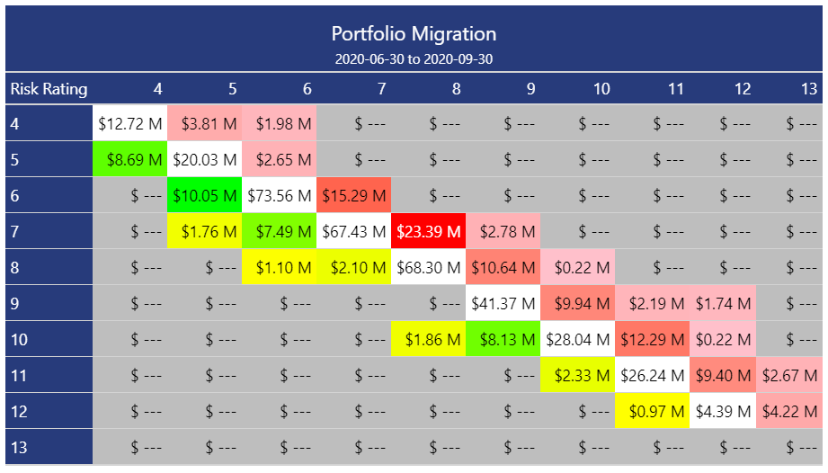
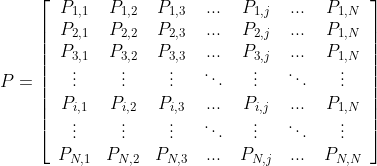

<!-- README.md is generated from README.Rmd. Please edit that file -->

# migrate 

<!-- badges: start -->

[](https://travis-ci.com/mthomas-ketchbrook/migrate)
[](https://www.tidyverse.org/lifecycle/#maturing)
<!-- badges: end -->

The goal of migrate is to provide credit analysts with an easy set of
tools for building *state migration matrices* (also known as *“state
transition matrices”*).

<br>  <br>

Currently, this package only supports the simple “cohort” methodology.
This estimates the probability of moving from state *i* to state *j* in
a single time step, echoing a Markov process. We can visualize this in a
matrix, for a credit portfolio with *N* unique, ordinal states.



Future development plans for this package include building functionality
for the more complex **duration**/**hazard** methodology, including both
the *time-homogeneous* and *non-homogeneous* implementations.

## Installation

You can install the released version of migrate from
[CRAN](https://CRAN.R-project.org) with:

``` r
install.packages("migrate")
```

And the development version from [GitHub](https://github.com/) with:

``` r
# install.packages("devtools")
devtools::install_github("mthomas-ketchbrook/migrate")
```

## Example

First, load the package & the mock dataset (as a data frame) using
`library()`

``` r
library(migrate)
data("mock_credit")
```

We can get a look at the data using `dplyr::glimpse()`

``` r
library(dplyr)
glimpse(mock_credit)
#> Rows: 900
#> Columns: 4
#> $ customer_id       <chr> "Customer_1083", "Customer_1468", "Customer_1430", "Customer_1498", "Customer_1272", "Customer_1058", "Customer_1397", "Customer_1061", "Customer_1199", "Customer_1120", "Customer_1053", "Customer_1106", "Customer_1165", "Customer_1008", "Customer_1196", "Customer_1064", "Customer_1231", "Customer_1315", "Customer_1127", "Customer_1184", "Customer_1361", "Customer_1290", "Customer_1004", "Customer_1096", "Customer_1130", "Customer_1297", "Customer_1401", "Customer_1425", "Customer_1437", "Customer_1005", "Customer_1357", "Customer_1316", "Customer_1208", "Customer_1065", "Customer_1423", "Customer_1087", "Customer_1162", "Customer_1147", "Customer_1251", "Customer_1268", "Customer_1245", "Customer_1206", "Customer_1236", "Customer_1063", "Customer_1246", "Customer_1079", "Customer_1371", "Customer_1091", "Customer_1261", "Customer_1284", "Customer_1157", "Customer_1278", "Customer_1441", "Customer_1037", "Customer_1176", "Customer_1181", "Customer_1171",...
#> $ date              <date> 2020-06-30, 2020-06-30, 2020-09-30, 2020-09-30, 2020-09-30, 2020-06-30, 2020-09-30, 2020-09-30, 2020-06-30, 2020-06-30, 2020-09-30, 2020-09-30, 2020-06-30, 2020-09-30, 2020-06-30, 2020-06-30, 2020-09-30, 2020-06-30, 2020-09-30, 2020-06-30, 2020-09-30, 2020-09-30, 2020-06-30, 2020-09-30, 2020-06-30, 2020-06-30, 2020-06-30, 2020-06-30, 2020-06-30, 2020-06-30, 2020-09-30, 2020-06-30, 2020-06-30, 2020-09-30, 2020-09-30, 2020-06-30, 2020-09-30, 2020-09-30, 2020-06-30, 2020-09-30, 2020-09-30, 2020-06-30, 2020-06-30, 2020-09-30, 2020-09-30, 2020-06-30, 2020-09-30, 2020-09-30, 2020-09-30, 2020-09-30, 2020-09-30, 2020-06-30, 2020-06-30, 2020-06-30, 2020-06-30, 2020-06-30, 2020-06-30, 2020-09-30, 2020-06-30, 2020-06-30, 2020-06-30, 2020-09-30, 2020-09-30, 2020-09-30, 2020-06-30, 2020-09-30, 2020-09-30, 2020-09-30, 2020-09-30, 2020-06-30, 2020-09-30, 2020-06-30, 2020-06-30, 2020-06-30, 2020-06-30, 2020-06-30, 2020-09-30, 2020-09-30, 2020-06-30, 2020-06-30, 2020-06...
#> $ risk_rating       <fct> 6, 10, 8, 5, 5, 6, 8, 8, 8, 11, 7, 8, 6, 10, 10, 5, 6, 5, 6, 7, 10, 4, 11, 10, 8, 5, 5, 6, 9, 10, 9, 10, 10, 8, 7, 7, 11, 7, 6, 7, 7, 8, 9, 6, 8, 7, 8, 10, 11, 8, 9, 8, 11, 8, 11, 7, 6, 6, 8, 9, 6, 6, 6, 6, 7, 9, 10, 10, 7, 11, 11, 6, 7, 6, 7, 6, 11, 9, 8, 5, 6, 5, 7, 6, 11, 7, 7, 9, 11, 11, 8, 12, 7, 6, 8, 6, 8, 9, 7, 7, 5, 6, 10, 9, 7, 8, 7, 8, 9, 6, 10, 6, 6, 4, 7, 12, 11, 12, 9, 8, 8, 11, 6, 4, 11, 5, 6, 7, 7, 10, 9, 8, 6, 8, 6, 10, 12, 7, 7, 6, 11, 10, 8, 6, 8, 12, 7, 11, 6, 11, 6, 7, 6, 4, 5, 9, 7, 10, 4, 4, 8, 7, 6, 8, 10, 9, 11, 6, 6, 9, 5, 11, 9, 6, 9, 11, 6, 6, 11, 6, 7, 5, 6, 8, 10, 7, 10, 8, 10, 9, 7, 9, 9, 8, 6, 7, 9, 7, 8, 10, 9, 10, 8, 9, 9, 4, 6, 10, 8, 6, 11, 4, 6, 7, 7, 9, 6, 5, 7, 8, 9, 6, 9, 11, 6, 7, 6, 6, 7, 8, 4, 9, 8, 6, 8, 7, 5, 7, 7, 9, 7, 7, 7, 9, 7, 11, 6, 9, 8, 8, 9, 4, 7, 12, 9, 7, 8, 8, 9, 6, 7, 8, 10, 9, 5, 6, 9, 8, 4, 7, 9, 8, 11, 9, 8, 11, 7, 6, 10, 9, 6, 7, 8, 9, 11, 6, 7, 6, 10, 9, 5, 8, 9, 11, 6, 8, 6, 8, 9, 7, 6, 8, ...
#> $ principal_balance <dbl> 2201000, 1538000, 3447000, 1302000, 2306000, 666000, 938000, 737000, 799000, 1747000, 722000, 1206000, 1040000, 1372000, 510000, 400000, 890000, 1021000, 1849000, 1205000, 503000, 637000, 750000, 673000, 3658000, 932000, 856000, 2881000, 989000, 1177000, 242000, 659000, 375000, 669000, 546000, 976000, 253000, 1232000, 1850000, 743000, 1156000, 787000, 1737000, 2218000, 1284000, 1283000, 1233000, 2013000, 853000, 1600000, 774000, 695000, 2672000, 1659000, 1273000, 1420000, 363000, 224000, 1932000, 2161000, 3197000, 2763000, 916000, 4921000, 253000, 619000, 877000, 618000, 2194000, 464000, 334000, 854000, 1493000, 515000, 4343000, 983000, 943000, 814000, 1259000, 1108000, 833000, 576000, 1223000, 492000, 2963000, 327000, 1261000, 961000, 1374000, 1424000, 376000, 2269000, 299000, 1065000, 1149000, 1964000, 947000, 390000, 1041000, 1270000, 2598000, 933000, 1793000, 551000, 1268000, 837000, 1686000, 967000, 312000, 593000, 484000, 223000, 509000, 1380000, 2...
```

Note that an important feature of the dataset is that there are exactly
two (2) unique values in the `date` column variable

``` r
unique(mock_credit$date)
#> [1] "2020-06-30" "2020-09-30"
```

To summarize the migration within the data, use the `migrate()` function

``` r
migrated_df <- migrate(
  data = mock_credit, 
  date = date, 
  rating = risk_rating, 
  metric = principal_balance
)

head(migrated_df)
#> # A tibble: 6 x 3
#>   risk_rating_start risk_rating_end principal_balance
#>   <fct>             <fct>                       <dbl>
#> 1 4                 4                         -557000
#> 2 4                 5                        -2732000
#> 3 4                 6                         -939000
#> 4 4                 7                               0
#> 5 4                 8                               0
#> 6 4                 9                               0
```

To create the state migration matrix, use the `build_matrix()` function

``` r
build_matrix(migrated_df)
#> Using  risk_rating_start  as the 'rating_start' column variable
#> 
#> Using  risk_rating_end  as the 'rating_end' column variable
#> 
#> Using  principal_balance  as the 'metric' column variable
#> 
#>           4        5        6       7         8       9      10      11      12       13
#> 4   -557000 -2732000  -939000       0         0       0       0       0       0        0
#> 5  -4882000  6396000   182000       0         0       0       0       0       0        0
#> 6         0 -3720000 -4721000  637000         0       0       0       0       0        0
#> 7         0 -1447000  3073000 -778000 -12258000 1997000       0       0       0        0
#> 8         0        0  -486000  825000  -3634000 3706000  750000       0       0        0
#> 9         0        0        0       0         0   54000 3288000 1281000 -765000        0
#> 10        0        0        0       0    258000   97000 3711000  187000 1192000        0
#> 11        0        0        0       0         0       0  239000 7516000 2082000 -2280000
#> 12        0        0        0       0         0       0       0 -309000 2175000  2052000
#> 13        0        0        0       0         0       0       0       0       0        0
```

Or, to do it all in one shot, use the `%>%`

``` r
mock_credit %>% 
  migrate(
    date = date, 
    rating = risk_rating, 
    metric = principal_balance
  ) %>% 
  build_matrix()
```
